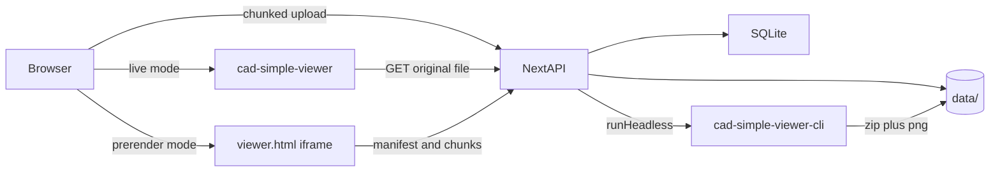

# Next.js CAD Drive Demo — Implementation Plan

Standalone Next.js sample app at `D:\code\cad-viewer-nextjs-demo` (not part of the cad-viewer monorepo). Install `@mlightcad/*` from **npm**. Demonstrates two official viewing architectures:

- **Live parse**: the browser opens the original DWG/DXF with `@mlightcad/cad-simple-viewer`
- **Prerendered**: the server converts drawings to an ACEX multi-file package via `@mlightcad/cad-simple-viewer-cli`; the browser loads display data only

Official hosting notes: [acex-web-hosting-guide.md](https://github.com/mlightcad/cad-viewer/blob/main/packages/cad-html-plugin/docs/acex-web-hosting-guide.md). Server-side conversion is **not** pure Node DWG parsing — it runs the same viewer pipeline inside Playwright headless Chromium.



## Goals (completed)

| ID | Task |
|----|------|
| scaffold | Scaffold Next.js App Router + Tailwind + drizzle/libsql; gitignore `data/` |
| upload-api | Chunked upload APIs (init / chunk / status / complete) + localStorage resume |
| convert-queue | Serial convert queue: `runHeadless` + unzip ACEX + preview PNG; status in SQLite |
| serve-acex | Drawing CRUD, original file / preview / ACEX routes (no `Content-Encoding` on `.gz`) |
| netdisk-ui | Drive home: upload progress, preview cards, both open modes, convert status |
| live-viewer | Client-only cad-simple-viewer + LibreDWG workers + simple-ui toolbar |
| prerender-viewer | iframe-hosted ACEX `viewer.html` |
| docs-verify | README + browser verification of upload / resume / both viewers |

## Tech stack

- **Next.js** App Router + TypeScript + Tailwind
- **SQLite**: `drizzle-orm` + `@libsql/client` (file DB; avoids `better-sqlite3` native builds on Windows)
- **Storage**: local `data/` directory (gitignored); drawings are not stored in the DB blob
- **Upload**: custom chunked + resumable upload (no tus; easier to read)
- **Convert**: `runHeadless` + project script `scripts/export-html-multi-preview.scr` (ACEX zip + PNG preview via `pngout`; published CLI runners may not include `jpgout`)
- **Live viewer**: client-only `next/dynamic({ ssr: false })` + `@mlightcad/cad-simple-ui-plugin`
- **Prerendered viewer**: iframe → per-drawing `viewer.html` + `drawing.acex.json` + `chunks/`
- **DWG**: `@mlightcad/libredwg-converter` (GPL — called out in README)
- **UI locale**: English by default; 中文 / English toggle; preference in `localStorage`
- Node **20+**; first run needs `pnpm setup:browser` (Playwright Chromium)

## Directory layout

```
cad-viewer-nextjs-demo/
  app/
    page.tsx                          # Drive home
    view/[id]/page.tsx                # Open drawing (mode=live|prerender)
    api/uploads/route.ts
    api/uploads/[id]/route.ts
    api/uploads/[id]/chunks/[index]/route.ts
    api/uploads/[id]/complete/route.ts
    api/drawings/route.ts
    api/drawings/[id]/route.ts
    api/drawings/[id]/file/route.ts
    api/drawings/[id]/preview/route.ts
    api/drawings/[id]/acex/[[...path]]/route.ts
  components/                         # Drive cards, upload, both viewers, i18n
  lib/                                # db, schema, storage, convert-queue, upload, i18n
  docs/PLAN.md                        # This plan (English)
  scripts/copy-workers.mjs
  scripts/export-html-multi-preview.scr
  data/                               # sqlite + files (gitignore)
  public/workers/
```

## Data model

Table `drawings`: `id`, `name`, `ext`, `size`, `status` (`uploading | processing | ready | failed`), `error`, `createdAt`.

Table `uploads`: `id`, `drawingId`, `fileName`, `totalSize`, `chunkSize`, `totalChunks`, `receivedBitmap`, `createdAt`. Disk paths are derived from ids (not stored in DB).

On-disk layout:

- `data/app.db`
- `data/uploads/{uploadId}/chunk-{n}`
- `data/drawings/{id}/original.{dwg|dxf}`
- `data/drawings/{id}/preview.png` (or `.jpg` if produced)
- `data/drawings/{id}/acex/viewer.html`, `drawing.acex.json`, `chunks/*.gz`

## Chunked resume upload

1. `POST /api/uploads` with `{ fileName, fileSize, lastModified }` → `{ uploadId, chunkSize: 2MiB, totalChunks }`. Client stores resume key `name+size+lastModified` in localStorage; on refresh, `GET` received chunks and continue.
2. `PUT /api/uploads/[id]/chunks/[index]`: raw bytes; validate index/size; write chunk file.
3. `GET /api/uploads/[id]`: list of received chunks for resume.
4. `POST /api/uploads/[id]/complete`: concatenate in order → write original → `status=processing` → enqueue convert (respond `202`; client polls drawing status).

Limits: `.dwg` / `.dxf` only; ~200MB max; path-traversal guards. Pause = stop PUTs; retry supported.

## Server-side prerender

In-process **serial queue** (Playwright is heavy; SQLite persists jobs; on Next restart, re-enqueue `processing` rows):

```ts
await runHeadless({
  inputPath: originalPath,
  scriptPath: pathTo('export-html-multi-preview.scr'),
  outputDir: tmpDir,
  mode: 'read'
})
```

Unzip with `fflate` (do not import full `@mlightcad/cad-html-plugin` into Node routes — it pulls Three.js). Store preview image; write ACEX directory as-is. On failure set `status=failed` + `error`.

**ACEX hosting rule** (official FAQ): `.acex.gz` / `.osnap.gz` must be returned as opaque bytes — **never** set `Content-Encoding: gzip`. Do not serve from `public/`; always use `GET /api/drawings/[id]/acex/[[...path]]`:

- `*.gz` → `Content-Type: application/octet-stream`
- `drawing.acex.json` → `application/json`
- `viewer.html` → `text/html`

iframe `src=/api/drawings/{id}/acex/viewer.html` so relative `./drawing.acex.json` stays same-origin under that prefix.

## Next.js + cad-simple-viewer

- `scripts/copy-workers.mjs` (postinstall / predev) copies into `public/workers/`:
  - `mtext-renderer-worker.js` from `@mlightcad/cad-simple-viewer`
  - `libredwg-parser-worker.js` + `libredwg-web.wasm` from `@mlightcad/libredwg-converter`
- Client: register LibreDWG converter; `AcApDocManager.createInstance({ container, baseUrl: same-origin /cad-data/, webworkerFileUrls, autoResize })`; then `acuiRegisterSimpleUiPlugin`. Fonts come from the `cad-data` git submodule, served by `GET /cad-data/[[...path]]` (CORS enabled for the Playwright CLI).
- Open: `fetch(/api/drawings/{id}/file)` → `openDocument(name, arrayBuffer, { mode: Read })`
- `next.config.ts`: `transpilePackages` for `@mlightcad/*`, `three`, `lodash-es`; `serverExternalPackages` for playwright / CLI / libsql; CAD UI must not SSR

## UI (drive-style, English default)

- **Home**: drag/drop or file picker; card grid (preview, name, size, time, status badge); skeleton while converting; retry convert on failure
- **Card actions**: Open (live parse) / Open (prerendered) — prerender disabled until `ready`
- **`/view/[id]?mode=live`**: fullscreen simple-viewer + back to drive
- **`/view/[id]?mode=prerender`**: fullscreen ACEX iframe (layers / layouts / measure from the export package)
- Language toggle: **English** default; Chinese available; saved preference in `localStorage` (does not auto-switch to Chinese from browser language)

Empty state: upload DWG/DXF, or **Load sample drawing** (`canteen.dwg` from local `/cad-data/data/canteen.dwg`) through the same upload/convert pipeline. Headless convert passes `baseUrl` so Chromium loads fonts from this app, not jsDelivr.

## README must cover

- Difference between the two open modes (perf/memory vs editable entities)
- `pnpm install` → `pnpm setup:browser` → `pnpm dev`
- GPL (LibreDWG), Chromium on Windows, first convert can be slow
- Why `.gz` must not be double-gzipped

Keep this demo out of the cad-viewer monorepo; do not change monorepo packages for this sample.
